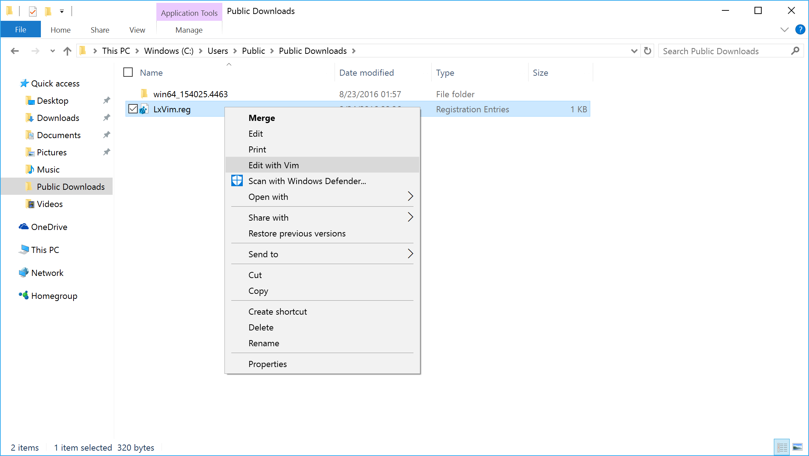
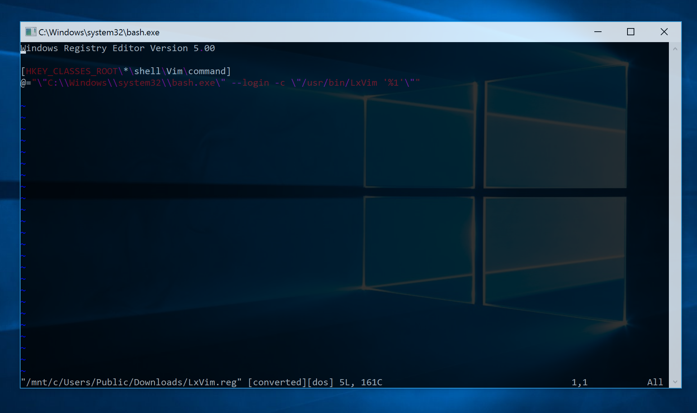

# LxVim
Add `Edit with Vim` to your Windows context menu- using vim from `Windows Subsystem for Linux (WSL/LXSS)`.

## Install
1) Import the [provided registry entry](LxVim.reg)

2) Copy [LxVim](LxVim) to /usr/bin/LxVim

